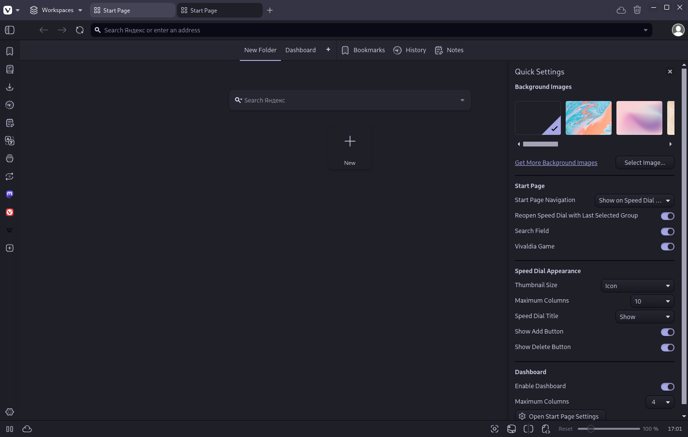

  <!-- STEP 1: Replace the placeholder URL (https://example.com) and placeholder name (Example) with actual data -->
  <h1>Moonbloom for <a href="https://example.com">Example</a></h1>
  
Gentle on the eyes, evoking the cozy tranquility of a serene night.

  <a href="https://github.com/moonbloom-theme/moonbloom">Homepage</a> • <a href="https://moonbloom.teplostanski.dev">Website</a> • <a href="https://github.com/orgs/moonbloom-theme/discussions">Discussions</a> • <a href="https://donate.teplostanski.dev">Support Us</a>

 

<!-- STEP 2: Replace the placeholder name (Example) with the application name, URL (https://example.com), and description with the correct information -->

> [Example](https://example.com) A short description of the application from the official source or Wikipedia.

## Install

See [INSTALL.md](./INSTALL.md)

## Team

<!-- STEP 3: Replace the URL (https://github.com/moonbloom-theme/template/graphs/contributors) with the link to the contributors page of the current repository -->

This theme is maintained by the following person(s) and a bunch of [awesome contributors](https://github.com/moonbloom-theme/template/graphs/contributors).

<!-- IMPORTANT: Do not modify the block below. The content between the comments CONTRIBUTORS_TABLE and CONTRIBUTORS_TABLE-END will be automatically updated with a generated contributors table using GitHub Actions -->

<!--CONTRIBUTORS_TABLE--><table><tr>
  <td align="center">
    <a href="https://github.com/teplostanski" title="Игорь Теплостанский">
      
     <b>Игорь Теплостанский</b>
    </a>
  </td>
</tr></table><!--CONTRIBUTORS_TABLE-END-->

 

<!-- STEP 4: Update the repository name (template) in the links to match the current repository name -->

  
  

